# IPsec Sentinel

## AI-Powered Drift-Aware Security Assessment System for Government VPN Infrastructure

IPsec Sentinel is a passive IPsec observability and assessment framework for evaluating VPN security posture, detecting configuration drift, and interpreting encrypted traffic characteristics in government and critical-infrastructure environments. The repository combines a real Containerlab/strongSwan testbed, packet and state capture tooling, an analytics pipeline, and AI-assisted explanation over recorded evidence.

<div align="center">


</div>

## Project Overview

This repository implements a research and engineering prototype around government-grade IPsec analysis. It is designed to answer questions such as:

- Are observed IPsec tunnel states consistent with the approved configuration?
- Are cryptographic settings drifting from expected policy?
- Are there signals of tunnel misuse, misconfiguration, or weak security posture?
- Can the traffic and state features be interpreted with AI-assisted reasoning and evidence-backed reporting?

The system is intentionally passive and non-intrusive: the sensor receives mirrored traffic and metadata rather than modifying the network path. The core evidence flow is:

- Containerlab + strongSwan generate real IPsec traffic and state
- eBPF/XDP, TShark, and Zeek gather live and durable evidence
- a Python state/feature pipeline normalizes observations
- an assessment engine compares observed state with expected baselines
- a Random Forest and SHAP layer add classification and explanation
- a dashboard and reports surface findings, drift, and recommendations

---

## Problem Statement

| Challenge | Traditional approach | IPsec Sentinel |
| --- | --- | --- |
| Large government VPN estates are complex and heterogeneous | Manual audit and specialist review of each tunnel and policy | Passive capture and comparison against expected state and policy |
| Security drift is hard to detect early | Periodic configuration review or ad hoc troubleshooting | Continuous comparison of observed vs. approved configuration |
| Encrypted traffic hides key characteristics | Deep packet inspection is limited or unavailable | Metadata, state, and packet-level evidence are captured without decrypting content |
| Compliance and risk assessment requires specialist interpretation | Analyst-dependent review of logs and configs | Structured findings, contextual risk, and AI-assisted explanation |
| Encrypted traffic telemetry is often fragmented | Multiple tools and disconnected logs | Normalized state, features, evidence, and reports in one pipeline |

---

## Solution Overview

IPsec Sentinel processes a real or emulated IPsec environment through a layered assessment pipeline. The system accepts traffic, state, configuration, and event metadata, then correlates observed values with expected baselines. It generates evidence-backed findings, drift warnings, and an AI-generated explanation layer for analyst review.



```mermaid
flowchart LR
    A[VPN Environment] --> B[IPsec Testbed]
    B --> C[Live Observation + Evidence Capture]
    C --> D[State / Feature Normalization]
    D --> E[Correlation & Baseline Comparison]
    E --> F[Security Assessment]
    F --> G[Drift Detection]
    G --> H[ML / XAI Engine]
    H --> I[Evidence / Audit Layer]
    I --> J[Dashboard + Reports + AI Explanation]
```

### What enters the system

- live IPsec traffic mirrored from the testbed
- strongSwan state such as IKE/SA and XFRM information
- PCAP/TShark/Zeek evidence
- metadata from packet-level and state-level observation
- mission and asset context for contextualizing findings

### What comes out of the system

- normalized protocol and state observations
- drift and security findings
- ML classification results with explainability
- audit-ready evidence records and chain-of-custody metadata
- dashboard and report output for analyst consumption

---

## Technology Stack

| Category | Technologies | Role in the system |
| --- | --- | --- |
| VPN / IPsec | strongSwan, Containerlab, XFRM, IKEv2, ESP, AH | Generates and observes real IPsec traffic and state |
| Traffic capture | TShark, Zeek, eBPF/XDP, tc/mirred, PCAP | Captures mirrored traffic and durable packet evidence |
| Network analysis | Linux networking, bridge, veth, iproute2, XFRM | Provides the packet path, interfaces, and state representation |
| AI / ML | scikit-learn, RandomForestClassifier, SHAP, Google Gemini | Produces classification, explainability, and narrative reasoning |
| Backend | Python, FastAPI, Pydantic, Uvicorn | Serves the control API, dataset pipeline, and analysis services |
| Frontend | React, Vite, TypeScript, HTML/CSS, Recharts | Provides the dashboard and interactive analysis UI |
| Data processing | NumPy, PyArrow, JSONL, Parquet, joblib | Normalizes, stores, and reuses datasets and model artifacts |
| Containerization | Docker, Dockerfiles, Containerlab | Runs the testbed topology and capture environment |
| Security / evidence | JSONL evidence, hash-chain/custody metadata, audit trail | Preserves provenance and supports reviewed findings |
| Development | pytest, shell scripts, venv, Make | Validates the repository and supports lab workflow |

---

## Architecture

The repository architecture is documented in [architecture.md](architecture.md) and reflected in the code under [controller/](controller/), [correlation/](correlation/), [ebpf/](ebpf/), and [sentinel-frontend/](sentinel-frontend/).

### Layer 1 — IPsec Testbed

#### Purpose
Provision a real IPsec environment that generates traffic and security-association state.

#### Why this layer exists
Government VPN environments are difficult to reason about without a reproducible testbed. This layer creates a controlled baseline for IKE and ESP/AH behavior before the assessment pipeline interprets it.

#### How it is implemented
The repo builds a five-container topology with Containerlab and strongSwan. GW-A is the authoritative observation point and mirrors the WAN traffic to a passive sensor path.

#### Technology Stack
| Technology | Role | Why it was chosen |
| --- | --- | --- |
| Containerlab | Topology orchestration | Creates the reproducible lab and network structure |
| strongSwan | IPsec implementation | Produces real IKE/ESP/AH sessions and state |
| Docker | Container runtime | Enables the lab topology and isolated network nodes |

#### Input
- network topology config
- strongSwan policy and state
- test traffic

#### Processing
- deploy the topology
- bring up gateways and hosts
- establish IPsec SAs
- generate traffic and state transitions

#### Output
- live traffic flow
- strongSwan state
- tunnel metadata

#### Layer-to-layer flow
This layer provides real IPsec traffic and state to the live observation and evidence capture layers.

### Layer 2 — Live Observation

#### Purpose
Capture mirrored network traffic in real time without altering the production path.

#### Why this layer exists
Passive observation is essential for encrypted tunnels, because it preserves the original communication flow while making it inspectable.

#### How it is implemented
GW-A mirrors traffic from its WAN interface using `tc`/`clsact` `mirred` actions. The mirrored traffic is fed to an audit tap and a sensor interface for eBPF/XDP analysis.

#### Technology Stack
| Technology | Role | Why it was chosen |
| --- | --- | --- |
| Linux tc / clsact / mirred | Traffic mirroring | Duplicate traffic for passive inspection |
| eBPF / XDP | Packet observation | Enables low-overhead live classification of IPsec traffic |
| Linux bridge / veth | Network isolation | Keeps traffic pass-through and mirror paths separate |

#### Input
- mirrored WAN traffic from GW-A
- packet stream from live network interfaces

#### Processing
- mirror traffic
- classify packet types
- aggregate packet events in 100 ms windows

#### Output
- XDP event stream
- live observed metadata and packet type labels

#### Layer-to-layer flow
This layer receives real IPsec traffic from the testbed and produces live event data consumed by the IPsec State Engine and feature pipeline.

### Layer 3 — Evidence Capture

#### Purpose
Preserve durable forensic evidence from the same captured observation path.

#### Why this layer exists
Security assessment requires evidence that can be reviewed later for verification and auditability.

#### How it is implemented
The repository records PCAPs and uses TShark and Zeek to parse packet-level metadata and higher-order network events.

#### Technology Stack
| Technology | Role | Why it was chosen |
| --- | --- | --- |
| TShark | Packet inspection | Extracts ESP/IKev2 and metadata from recorded traffic |
| Zeek | Event correlation | Adds higher-level protocol/event visibility |
| PCAP | Evidence capture | Stores the raw packet record |

#### Input
- mirrored traffic copies
- recorded packet files
- live packet feed

#### Processing
- record PCAPs
- decode ESP/IKE fields
- emit audit events and network evidence

#### Output
- PCAP files
- TShark metadata
- Zeek events
- durable evidence records

#### Layer-to-layer flow
This layer provides packet-level evidence to the state engine and the evidence/audit layer for verification and investigation.

### Layer 4 — IPsec State Engine

#### Purpose
Normalize observed IKE, SA, and ESP/AH state into a common representation.

#### Why this layer exists
IPsec security assessment depends on reliable state reconstruction across protocol variants and tunnel configurations.

#### How it is implemented
The analysis layer reads raw packet events and strongSwan state, then builds a normalized state model for later comparison and assessment.

#### Technology Stack
| Technology | Role | Why it was chosen |
| --- | --- | --- |
| Python | Orchestration | Connects packet capture, state extraction, and analytics |
| strongSwan outputs | Source of SA state | Provides authoritative state information for IKE and child SAs |
| JSONL | Normalized event storage | Keeps state and evidence records append-only and reviewable |

#### Input
- live events
- packet metadata
- SA state outputs

#### Processing
- parse IKE/ESP/AH metadata
- normalize state entries
- create observational object models

#### Output
- normalized state records
- per-tunnel state representation

#### Layer-to-layer flow
This layer receives packet and state observations and produces normalized IPsec state for feature extraction and correlation.

### Layer 5 — Feature / State Engine

#### Purpose
Aggregate observation data into consistent windows for downstream analytics.

#### Why this layer exists
Security characteristics are easier to reason about when observed traffic is grouped into periodic windows rather than processed as isolated packets.

#### How it is implemented
The repository builds 100 ms window records from XDP and state events, producing a v2 feature schema for machine learning, comparison, and reporting.

#### Technology Stack
| Technology | Role | Why it was chosen |
| --- | --- | --- |
| Python | Feature assembly | Standardizes and validates records |
| NumPy | Numeric processing | Handles feature vectors and aggregation |
| PyArrow | Serialization | Supports structured record output |

#### Input
- normalized state
- packet events
- time-bucketed traffic values

#### Processing
- windowing by time bucket
- feature construction
- schema validation

#### Output
- feature vectors
- per-window state records

#### Layer-to-layer flow
This layer produces feature/state data consumed by the correlation and assessment core and ML/XAI engine.

### Layer 6 — Correlation & Assessment Core

#### Purpose
Compare observed state against expected state and identify drift or security-relevant deviations.

#### Why this layer exists
In a government network, approved configuration and live state often diverge. This layer creates the basis for drift-aware assessment.

#### How it is implemented
The correlation engine compares expected and observed states, then uses security reasoning to surface discrepancies and finding evidence.

#### Technology Stack
| Technology | Role | Why it was chosen |
| --- | --- | --- |
| Python | Analysis logic | Encapsulates assessment and comparison logic |
| JSON-based contracts | Data interchange | Keeps findings and state consistent across layers |
| rule-based assessment | Deterministic logic | Enables precise expected-vs-observed checks |

#### Input
- expected state and baseline
- observed state
- feature records

#### Processing
- correlate expected and observed state
- run drift checks
- generate preliminary findings

#### Output
- drift findings
- security findings
- evidence references

#### Layer-to-layer flow
This layer receives normalized state and produces findings consumed by the ML/XAI engine and the evidence/audit layer.

### Layer 7 — Baseline & Drift Detection

#### Purpose
Determine whether a VPN instance remains aligned with the approved security baseline.

#### Why this layer exists
Security drift is a common governance issue: policy changes, configuration errors, or unexpected tunnel states can silently move a network away from its approved posture.

#### How it is implemented
The repo models expected configuration and observed state, then compares them to flag divergence. This is not a generic monitoring system; it is tuned for IPsec state and policy comparison.

#### Technology Stack
| Technology | Role | Why it was chosen |
| --- | --- | --- |
| baseline models | expected policy state | Defines approved values |
| Python comparison logic | drift detection | Evaluates deltas and their impact |

#### Input
- expected configuration
- observed state
- contextual metadata

#### Processing
- compare approved vs. observed settings
- score significance of change
- attach drift metadata

#### Output
- drift events
- severity context
- policy deviation records

#### Layer-to-layer flow
This layer produces drift findings that are consumed by the fundamental assessment and downstream risk interpretation engines.

### Layer 8 — Fundamental IPsec Assessment

#### Purpose
Evaluate the core security posture of the tunnel: cryptographic algorithms, modes, integrity, DH groups, and policy alignment.

#### Why this layer exists
Many IPsec issues are not packet errors; they are algorithm, policy, or configuration outcomes that need explicit assessment.

#### How it is implemented
The system interprets strongSwan and traffic data to reason about encryption, authentication, PFS, mode, and protocol characteristics, then packages those findings in a reviewable structure.

#### Technology Stack
| Technology | Role | Why it was chosen |
| --- | --- | --- |
| strongSwan configuration models | Protocol source | Explains the negotiated tunnel state |
| rule-driven assessment | Security classification | Keeps the assessment deterministic and explainable |

#### Input
- negotiated tunnel properties
- protocol metadata
- policy metadata

#### Processing
- interpret mode and cipher settings
- check algorithm strength and policy conformance
- map observations to security posture

#### Output
- security findings
- cryptographic posture summary
- policy comparison results

#### Layer-to-layer flow
This layer consumes baseline and drift results and feeds them to the ML/XAI layer and evidence records.

### Layer 9 — ML / XAI Engine

#### Purpose
Add classification and explainability to traffic and state observations.

#### Why this layer exists
A purely rule-based pipeline is useful, but some characteristics are easier to reason about through classification over traffic-shape features and explainability over model decisions.

#### How it is implemented
The repository contains a Random Forest classifier and SHAP-based explanation workflow for traffic-profile classification and feature importance analysis. The model artifacts are generated and validated as part of the pipeline.

#### Technology Stack
| Technology | Role | Why it was chosen |
| --- | --- | --- |
| scikit-learn | ML model | Provides a robust, reproducible classifier |
| RandomForestClassifier | Decision model | Appropriate for structured traffic/profile classification |
| SHAP | Explainability | Shows feature influence and supports analyst trust |
| joblib | Model persistence | Serializes trained model artifacts |

#### Input
- feature vectors
- state-derived traffic windows
- results from assessment pipeline

#### Processing
- train or load model
- score feature vectors
- apply SHAP interpretation to explain output

#### Output
- classification result
- feature importance and explanation data
- contextualized ML findings

#### Layer-to-layer flow
This layer consumes correlation outputs and produces explainable security judgments that are consumed by the evidence/audit and dashboard layers.

### Layer 10 — Mission Context

#### Purpose
Interpret findings via the operational importance of the asset, route, or mission.

#### Why this layer exists
A weak cryptographic setting on a low-criticality service is not equivalent to the same finding on a high-value government or critical-infrastructure link. Context matters.

#### How it is implemented
The repository includes mission-context and asset-profile logic so assessments can be contextualized by importance rather than treated as purely technical results.

#### Technology Stack
| Technology | Role | Why it was chosen |
| --- | --- | --- |
| Python models | Context representation | Encodes asset and mission profiles |
| correlation logic | Contextualization | Integrates mission importance into risk framing |

#### Input
- asset metadata
- mission profile
- findings

#### Processing
- apply criticality weighting
- contextualize risk according to mission value

#### Output
- contextualized risk and priority

#### Layer-to-layer flow
This layer augments assessment findings before the final recommendation and response stage.

### Layer 11 — Cross-Signal Disagreement

#### Purpose
Compare multiple assessment signals to detect disagreement and reduce false confidence.

#### Why this layer exists
Different signal sources may disagree about the underlying issue. Comparing them helps distinguish between a configuration drift, a transient packet artifact, or a broader operational problem.

#### How it is implemented
The pipeline combines observations, baseline checks, and model output to reconcile disagreement and produce contextualized risk.

#### Input
- ML output
- drift findings
- observed-state and policy assessments

#### Processing
- reconcile multiple signals
- flag disagreement and confidence issues

#### Output
- contextualized risk or unresolved ambiguity

#### Layer-to-layer flow
This layer receives the outputs of assessment and ML reasoning and passes a final contextualized view downstream.

### Layer 12 — Evidence / Audit Layer

#### Purpose
Record findings with provenance, integrity, and legal/operational traceability.

#### Why this layer exists
Analysts and reviewers need evidence trails that can explain how a conclusion was reached and whether it has been tampered with.

#### How it is implemented
The repo keeps JSONL evidence records, references the underlying packet and state artifacts, and records custody- and hash-related metadata in the evidence/audit structures.

#### Technology Stack
| Technology | Role | Why it was chosen |
| --- | --- | --- |
| JSONL | Evidence log | Simple append-only event trail |
| audit metadata | Provenance | Keeps a chain of custody and evidence linkage |
| Python | orchestration | Performs evidence registration and linkage |

#### Input
- verified findings
- observation artifacts
- output from correlation and ML layers

#### Processing
- register evidence
- link findings to supporting artifacts
- record chain-of-custody data

#### Output
- verified finding bundle
- evidence-linked records

#### Layer-to-layer flow
This layer takes the final findings and their evidence and passes them to the AI explanation and conclusion/reporting layers.

### Layer 13 — Gemini / AI Explanations

#### Purpose
Translate evidence and findings into analyst-friendly narrative explanations.

#### Why this layer exists
A dense set of security findings is much easier to review when the system can explain why the finding was raised and what evidence supports it.

#### How it is implemented
The repository includes a Gemini-backed explanation provider that consumes whitelisted investigation context and produces narrative output. When no Gemini key is configured, the backend falls back to deterministic template-based responses using recorded values.

#### Technology Stack
| Technology | Role | Why it was chosen |
| --- | --- | --- |
| Google GenAI | LLM provider | Produces natural-language explanation for evidence-backed findings |
| Python service layer | orchestration | Handles prompt construction and context gating |

#### Input
- verified findings
- evidence context
- analytic records

#### Processing
- prepare safe, bounded context
- generate short explanation or recommendation text

#### Output
- natural-language narrative summaries
- contextual explanation for analysts

#### Layer-to-layer flow
This layer receives verified findings and produces presentation-ready explanation and recommendation content for the dashboard and analysts.

### Layer 14 — Sentinel Dashboard

#### Purpose
Present the current observations, findings, drift, evidence, and recommendations in a single interface.

#### Why this layer exists
Analysts need a consistent, human-readable view of the security trail, not just raw logs or disconnected JSON files.

#### How it is implemented
The repo contains both a static FastAPI-served dashboard and a Vite/React frontend in [sentinel-frontend/](sentinel-frontend/). The UI exposes the state, findings, and experiment controls.

#### Technology Stack
| Technology | Role | Why it was chosen |
| --- | --- | --- |
| FastAPI static serving | backend UI host | Exposes the dashboard assets from the Python app |
| React + Vite | interactive UI | Provides a modern dashboard and analyst workflow |
| Recharts | charting | Supports visual evidence and trends |

#### Input
- findings
- drift records
- traffic metadata
- AI explanations

#### Processing
- render status, findings, and charts
- mirror backend data into analyst-facing views

#### Output
- dashboard pages
- visual summaries
- operational recommendations

#### Layer-to-layer flow
This layer synthesizes the final outputs of the assessment and explanation pipeline into an analyst-facing, reviewable experience.

---

## Technology-to-Layer Mapping

| Layer | Technologies | Primary responsibility |
| --- | --- | --- |
| IPsec Testbed | Containerlab, strongSwan, Docker | Creates real IPsec traffic and tunnel state |
| Live Observation | tc, mirred, eBPF/XDP, Linux interfaces | Captures live packet metadata |
| Evidence Capture | TShark, Zeek, PCAP | Stores packet evidence and event data |
| IPsec State Engine | Python, JSONL, strongSwan state | Normalizes the security-association state |
| Feature / State Engine | NumPy, PyArrow, Python | Builds per-window features |
| Correlation & Assessment Core | Python, rule-based logic | Compares expected and observed state |
| Baseline / Drift Detection | baseline comparisons, Python logic | Flags configuration drift |
| Fundamental IPsec Assessment | policy logic, tunnel metadata | Interprets crypto and mode posture |
| ML / XAI Engine | scikit-learn, SHAP, joblib | Classifies traffic state and explains it |
| Mission Context | Python context models | Applies operational criticality |
| Cross-Signal Disagreement | correlation logic | Resolves conflicting signals |
| Evidence / Audit Layer | JSONL, audit metadata | Preserves provenance and trust |
| Gemini / AI Explanations | Google GenAI | Narrates assessment results |
| Sentinel Dashboard | FastAPI, React, Vite, Recharts | Presents findings to business and analyst users |

---

## End-to-End Data Flow

```text
VPN Environment
      ↓
IPsec Testbed (Containerlab + strongSwan)
      ↓
Live mirror + evidence capture (tc + eBPF/XDP + TShark + Zeek)
      ↓
Normalized IPsec state and packet metadata
      ↓
Feature / state windowing
      ↓
Expected vs. observed correlation
      ↓
Drift detection + fundamental assessment
      ↓
Random Forest classification + SHAP explanation
      ↓
Evidence registration + audit trail
      ↓
AI summary + dashboard/reporting layer
```

At each transition, the raw packet and state inputs are transformed into higher-level reasoning artifacts:

- raw packets → structured IPsec metadata
- metadata → normalized state and features
- state/features → drift and risk findings
- findings → explainable classification and audit evidence
- evidence → dashboard and narrative output

---

## Drift-Aware Security Assessment

### What is security drift?
Security drift is the difference between the approved VPN security baseline and the observed operational state. In a government VPN estate, this can include algorithm drift, policy mismatch, changed tunnel parameters, or unexpected states that no longer align with the approved posture.

| Baseline | Observed state | Drift | Impact |
| --- | --- | --- | --- |
| Approved cipher and integrity policy | Actual negotiated settings | Mismatch in algorithms or mode | Increases policy and compliance risk |
| Expected tunnel route and state | Live SA / XFRM state | Missing or altered association | Affects availability and verification |
| Authoritative configuration | Observed metadata | Deviation from intended posture | Creates security and governance concerns |

The repository’s assessment logic explicitly compares expected and observed state, then packages the deviations into evidence-backed findings. This is the core concept behind the “drift-aware” naming in the project.

---

## AI / ML Component

### Why AI is included
The repository uses AI/ML to add structured classification and explainability over network and tunnel-derived features. It does not claim fully autonomous remediation or autonomous enforcement.

### What data enters the ML layer
- feature vectors from the 100 ms aggregation pipeline
- state-derived traffic metadata
- IPsec traffic profile and timing information

### What is actually implemented
- Random Forest classification over traffic profile data
- SHAP-based model explanation and feature importance analysis
- optional Google Gemini explanation layer over recorded evidence and findings

### What it does not do
- It does not infer hidden plaintext from encrypted traffic
- It does not autonomously modify the network
- It does not claim full production certification or operational enforcement

### Downstream consumption
ML output is fed into the assessment and evidence pipeline and then surfaced through the dashboard and response layer.

---

## Security Assessment / Compliance

The project evaluates the security posture of IPsec tunnels via observed state and comparison logic. This includes core attributes such as:

- encryption algorithm and integrity mode
- ESP/AH/IKE usage patterns
- tunnel vs. transport mode characteristics
- authentication and key-exchange metadata
- PFS-related configuration and policy state
- drift from expected baseline settings

The repository does not present itself as a formal compliance certification engine, but it does support structured review against policy and operational security expectations. The code and reports reference drift and assessment logic rather than formal NIST or CNSA certification workflows.

---

## Passive / Non-Intrusive Analysis

A major design constraint is passivity. The repository is built around mirrored traffic and metadata collection rather than any in-path interception or state mutation.

This matters because:

- government and critical-infrastructure networks often cannot accept intrusive inspection
- production VPN traffic must remain observable without changing the data plane
- encrypted traffic can be analyzed through metadata, state, and protocol behavior without decryption

The observed path uses a mirror to a sensor rather than changing the tunnel path or injecting traffic into the network.

---

## Dashboard / User Interface

The repository includes both a FastAPI static dashboard and the more modern Vite/React dashboard under [sentinel-frontend/](sentinel-frontend/).

| Dashboard component | Purpose |
| --- | --- |
| Experiment controls | Launch and monitor IPsec testbed runs |
| Security findings | Shows security posture and drift results |
| Traffic / observation views | Displays live metadata and evidence status |
| AI summaries | Puts ML and Gemini output into analyst-readable format |
| Evidence / audit state | Links findings to underlying data and review trail |

---

## Natural Language Query / AI Assistant

The repository includes an AI explanation layer based on Google Gemini. It is used to turn recorded evidence into short reasoning outputs over approved context rather than raw free-form inference.

This capability supports questions such as:

- “Which tunnels are deviating from the approved baseline?”
- “What cryptographic posture was observed?”
- “What is the evidence trail behind this drift finding?”

The assistant is intentionally constrained to a whitelisted context and does not replace the underlying assessment engine.

---

## Government VPN Security Scenario

1. A government department operates multiple IPsec tunnels across critical network links.
2. An approved security baseline defines the expected tunnel configuration and policy.
3. Real traffic and strongSwan state are generated in the local testbed.
4. The system mirrors traffic and records metadata from the observation path.
5. The state and feature pipes normalize observations into comparable records.
6. The correlation engine compares observed values with expected baseline values.
7. Drift and security findings are produced and contextualized.
8. Random Forest and SHAP provide classification and explainability.
9. The evidence and audit layer retain the finding provenance.
10. Analysts review the results on the dashboard and in reports.

---

## Key Features

| Feature | Description |
| --- | --- |
| IPsec Testbed | Real Containerlab and strongSwan toplogy for traffic generation |
| Passive Observation | Mirrored packet capture without in-path traffic modification |
| Evidence Capture | TShark and Zeek packet/event capture and durable evidence |
| State Normalization | IKE/ESP/AH state built into consistent platform-level records |
| Drift Detection | Expected-vs-observed comparison over approved policy |
| Security Assessment | Cryptographic and state posture evaluation |
| ML Classification | Random Forest classification over traffic features |
| XAI | SHAP explainability over model output |
| AI explanation | Gemini-backed analyst summary over verified context |
| Dashboard and reporting | Analyst-facing UI and evidence-oriented reporting |

---

## Project Structure

```text
readme/
├── architecture.md                  # architecture overview and layer flow
├── README.md                       # project entry point
├── requirements.txt                # Python runtime dependencies
├── .example.env                    # environment template for local settings
├── campaign.json                   # default campaign inputs
├── campaign-quality.json            # quality-oriented campaign config
├── campaigns/                      # named campaign plans
├── configs/                        # strongSwan and topology configs
├── controller/                     # control plane, dataset generation, ML, capture
├── correlation/                    # assessment, risk, XAI, evidence, API logic
├── demo/                           # demo assets and example material
├── docs/                           # verification, architecture, and project docs
├── ebpf/                           # eBPF/XDP source and monitor artifacts
├── frontend/                       # static dashboard assets served by FastAPI
├── gateway-image/                  # gateway container image definitions
├── host-image/                     # host container image definitions
├── sentinel-frontend/              # Vite/React dashboard implementation
├── scripts/                        # install, run, status, stop, and deployment scripts
├── tests/                          # analysis-side tests and fixtures
├── topology/                       # Containerlab topologies
├── transport-host-image/           # transport-mode testbed image definitions
├── vendor/                         # vendored or third-party support code
├── live_events.jsonl               # live event record artifact
├── results/                        # local generated evidence (git-ignored)
└── out/                            # generated output (git-ignored)
```

---

## Installation and Setup

### Prerequisites

The repository expects a Linux host with Docker, Containerlab, and Python tooling.

- Linux host OS
- Docker and Docker daemon access
- Containerlab >= 0.79.0
- Python 3.x (the repo pins Python 3.14-compatible packages in [requirements.txt](requirements.txt))
- `python3-yaml` / `pyyaml`
- `iproute2` tools such as `ip` and `bridge`
- eBPF toolchain only when rebuilding the XDP monitor (`clang`, `llvm`, `bpftool`, `libbpf`, `libelf`, `libz`, `make`)
- Node.js / npm for the Vite dashboard in [sentinel-frontend/](sentinel-frontend/)

### Python setup

```bash
git clone <repository-url>
cd <repository>
python3 -m venv .venv
. .venv/bin/activate
pip install -r requirements.txt
cp .example.env .env
```

### Frontend setup

```bash
cd sentinel-frontend
npm install
npm run dev
```

### Testbed setup

```bash
cd <repository>
./scripts/install.sh
./scripts/run.sh
./scripts/status.sh
```

---

## Configuration

The repository uses a small set of environment and runtime configuration inputs. The main examples are in [.example.env](.example.env) and the controller configuration models.

| Variable / setting | Purpose | Example |
| --- | --- | --- |
| `SIHEXEC_MODE` | Runtime execution mode | `DRY_RUN` |
| `SIHAPI_HOST` | Backend bind host | `127.0.0.1` |
| `SIHAPI_PORT` | Backend port | `8000` |
| `GEMINI_API_KEY` | Optional AI explanation key | set in local `.env` only |
| `GEMINI_MODEL` | Gemini model selection | `gemini-3.8-flash` |
| `SIH_STREAM_WINDOW_MS` | Live analysis window size | `100` |
| `SIHEVIDENCE_ROOT` | Evidence root directory | `evidence` |

The lab topology and IPsec settings are defined under [topology/](topology/) and [configs/](configs/).

---

## Running the System

### Start the backend

```bash
cd <repository>
. .venv/bin/activate
python -m uvicorn controller.api:app --host 0.0.0.0 --port 8000
```

### Start the frontend

```bash
cd sentinel-frontend
npm run dev -- --host 0.0.0.0
```

### Start the testbed

```bash
cd <repository>
./scripts/run.sh
```

### Check health

```bash
cd <repository>
./scripts/status.sh
```

### Stop the lab

```bash
cd <repository>
./scripts/stop.sh
```

---

## Verification

The repository includes verification scripts and reports under [docs/verification/](docs/verification/) and [docs/README.md](docs/README.md). In practice, the system is verified by checking:

- Docker and Containerlab health
- IPsec SA establishment (`swanctl --list-sas`)
- XFRM state and policy installation
- connectivity tests from host to host
- mirrored traffic on the sensor path
- TShark and Zeek evidence capture
- model/artifact generation and ML explainability outputs

Example verification commands:

```bash
./scripts/status.sh
curl http://127.0.0.1:8000/health
curl http://127.0.0.1:5173/
```

---

## Prototype Screenshots

### Dashboard

> **[Insert Dashboard Screenshot Here]**

```text
Screenshot:
[                                      ]
[                                      ]
[                                      ]
```

### VPN Testbed

> **[Insert VPN Testbed Screenshot Here]**

```text
Screenshot:
[                                      ]
[                                      ]
[                                      ]
```

### Security Assessment

> **[Insert Security Assessment Screenshot Here]**

```text
Screenshot:
[                                      ]
[                                      ]
[                                      ]
```

### Drift Detection

> **[Insert Drift Detection Screenshot Here]**

```text
Screenshot:
[                                      ]
[                                      ]
[                                      ]
```

### AI / NLQ Interface

> **[Insert AI/NLQ Screenshot Here]**

```text
Screenshot:
[                                      ]
[                                      ]
[                                      ]
```

---

## Output / Results

The system produces the following types of outputs:

| Output | Meaning | Consumer |
| --- | --- | --- |
| live IPsec events | live classification and packet metadata | analytics pipeline |
| normalized state | driven by observed IKE/ESP/AH data | assessment engine |
| drift findings | differences between expected and actual state | analysts and reports |
| security findings | cryptographic and policy posture assessment | operators |
| ML classification | probability and traffic-shape label output | correlation layer |
| SHAP explanation | feature contributions supporting the model output | analysts |
| evidence logs | packet and event provenance | audit / investigation |
| dashboard summary | final analyst-facing interpretation | end users |

---

## Security Considerations

### Implemented security controls

- passive observation rather than in-path enforcement
- environment variables kept in local `.env` files rather than committed source control
- evidence logging and provenance metadata
- fail-closed execution defaults for production execution settings

### Recommended production hardening

- restrict network paths and access to the dashboard and backend
- rotate Gemini API keys and avoid committing secrets
- maintain separate environments for lab and operational use
- review access to evidence and audit records

---

## Limitations

This repository is a research and prototype system, not a turnkey enterprise SOC product.

- the testbed is meant for controlled lab and assessment workflows
- the code relies on real network and container dependencies for live verification
- Some analysis pieces are model- and evidence-dependent rather than production-fully autonomous
- the AI explanation layer is bounded by safe context and explicit configuration
- the repository documents verification and limitations rather than claiming formal compliance certification

---

## Future Enhancements

The following are realistic future work items rather than implemented features:

- broader IPsec policy coverage and additional protocol variants
- larger and more diverse training datasets for ML classification
- richer mission and asset criticality models
- SIEM or SOC platform integration
- continuous monitoring and alerting for drift conditions
- expanded compliance and policy mapping beyond the current assessment logic
- automated remediation workflows with human approval gates

---

## Project Impact

### Operational impact
The project improves how VPN performance and posture are reasoned about by turning packet and state evidence into a standard assessment flow.

### Security impact
It increases visibility into IPsec tunnel state, configuration drift, and encrypted traffic characteristics, which is valuable in government and critical-infrastructure environments.

### Economic impact
It reduces manual inspection effort by automating evidence collection, comparison, and structured analysis.

### Social / national impact
The project is relevant to government and critical communications infrastructure because reliable and reviewable VPN assessment is essential for secure information exchange and policy enforcement.

---

## Why IPsec Sentinel?

| Traditional approach | IPsec Sentinel |
| --- | --- |
| Manual inspection of tunnel and crypto state | Automated, evidence-backed assessment |
| Static or periodic review | Drift-aware comparison of expected vs. observed state |
| Analyst-only interpretation | Structured assessment and AI-assisted explanation |
| Fragmented packet and log evidence | Unified state, evidence, and reporting pipeline |

The project is valuable because it combines passive observation, security reasoning, and explainability into a single IPsec assessment workflow suited for lab testing and structured review.

---

## Conclusion

IPsec Sentinel is a passive, evidence-driven framework for analyzing IPsec security posture, identifying operational drift, and supporting analyst review in government-grade VPN environments. It is technically grounded in real lab infrastructure, packet capture, eBPF/XDP observation, strongSwan state, and a Python-based assessment and ML pipeline. The repository is best understood as a research and engineering prototype for secure VPN assessment rather than a turnkey production compliance platform.

For the current verified scope, architecture details, and limitations, see [architecture.md](architecture.md) and [docs/README.md](docs/README.md).

`eth1/eth2/eth3`). Health checks and first-run provisioning live in `deploy-ipsec.sh`.

---

## Final Validation Checklist

```text
[ ] install.sh exits 0 (idempotent across re-runs)
[ ] five containers running
[ ] GW-A observation ready: eth2 ing+eg mirror -> audit-tap0 + eth3 -> sensor
[ ] br-wan members = gw-a eth2, gw-b eth2 (sensor NOT a member)
[ ] sensor ip_forward=0
[ ] charon running on both gateways, configs loaded
[ ] IKEv2 SA + CHILD_SA lan-a-to-lan-b ESTABLISHED (ESP:AES_GCM_16-256)
[ ] XFRM state/policy present, counters advance
[ ] Host-A → Host-B ping 0% packet loss (and reverse)
[ ] ESP mirrored 1:1 from gw-a eth2 to sensor eth1
[ ] audit-tap0 sees ESP in gw-a
[ ] xdp_monitor captures ESP on sensor eth1 (generic/SKB mode)
[ ] run.sh on an already-healthy lab converges (no blind redeploy)
[ ] stop.sh tears down cleanly; next run.sh redeploys and passes fully
```

This is the validated observation-aware IPsec testbed for the project.
