# IPsec Sentinel

## AI-Powered Drift-Aware Security Assessment System for Government VPN Infrastructure

IPsec Sentinel is a passive IPsec observability and assessment framework for evaluating VPN security posture, detecting configuration drift, and interpreting encrypted traffic characteristics in government-grade VPN environments.

## Project Overview

This repository implements a research and engineering prototype around government-grade IPsec analysis. It is designed to answer questions such as: Are observed IPsec tunnel states consistent with the approved configuration, are cryptographic settings drifting from expected policy, are there signs of tunnel misuse or weak security posture, and can traffic and state features be interpreted with AI-assisted reasoning and evidence-backed reporting?

The system is intentionally passive and non-intrusive: it receives mirrored traffic and metadata rather than modifying the network path. The evidence flow is straightforward: Containerlab + strongSwan generate real IPsec traffic and state, eBPF/XDP, TShark, and Zeek collect live and durable evidence, a Python state/feature pipeline normalizes observations, an assessment engine compares them against expected baselines, a Random Forest and SHAP layer adds classification and explanation, and a dashboard and reports surface findings, drift, and recommendations.

---

## Problem Statement

| Challenge | Traditional approach | IPsec Sentinel |
| --- | --- | --- |
| Large government VPN estates are complex and heterogeneous | Manual audit and specialist review of each tunnel and policy | Passive capture and comparison against expected state and policy |
| Security drift is hard to detect early | Periodic configuration review or ad hoc troubleshooting | Continuous comparison of observed vs. approved configuration |
| Encrypted traffic hides key characteristics | Deep packet inspection is limited or unavailable | Metadata, state, and packet-level evidence are captured without decrypting content |
| Compliance and risk assessment requires specialist interpretation | Analyst-dependent review of logs and configs | Structured findings, contextual risk, and AI-assisted explanation |
| Encrypted traffic telemetry is often fragmented | Multiple tools and disconnected logs | Normalized state, features, evidence, and reports in one pipeline |

---

## Solution Overview

IPsec Sentinel processes a real or emulated IPsec environment through a layered assessment pipeline. It accepts traffic, state, configuration, and event metadata, correlates observed values with expected baselines, and turns the result into measurable security findings and analyst-ready explanations.

```mermaid
flowchart LR
    A[VPN Environment] --> B[IPsec Testbed]
    B --> C[Live Observation + Evidence Capture]
    C --> D[State / Feature Normalization]
    D --> E[Correlation & Baseline Comparison]
    E --> F[Security Assessment]
    F --> G[Drift Detection]
    G --> H[ML / XAI Engine]
    H --> I[Evidence / Audit Layer]
    I --> J[Dashboard + Reports + AI Explanation]
```

### What enters the system

Live IPsec traffic from the testbed, strongSwan state such as IKE/SA and XFRM information, PCAP/TShark/Zeek evidence, metadata from packet-level and state-level observation, and mission and asset context all feed into the system.

### What comes out of the system

The system produces normalized protocol and state observations, drift and security findings, ML classification with explainability, audit-ready evidence records with chain-of-custody metadata, and dashboard/report output for analyst consumption.

---

## Technology Stack

| Category | Technologies | Role in the system |
| --- | --- | --- |
| VPN / IPsec | strongSwan, Containerlab, XFRM, IKEv2, ESP, AH | Generates and observes real IPsec traffic and state |
| Traffic capture | TShark, Zeek, eBPF/XDP, tc/mirred, PCAP | Captures mirrored traffic and durable packet evidence |
| Network analysis | Linux networking, bridge, veth, iproute2, XFRM | Provides the packet path, interfaces, and state representation |
| AI / ML | scikit-learn, RandomForestClassifier, SHAP, Google Gemini | Produces classification, explainability, and narrative reasoning |
| Backend | Python, FastAPI, Pydantic, Uvicorn | Serves the control API, dataset pipeline, and analysis services |
| Frontend | React, Vite, TypeScript, HTML/CSS, Recharts | Provides the dashboard and interactive analysis UI |
| Data processing | NumPy, PyArrow, JSONL, Parquet, joblib | Normalizes, stores, and reuses datasets and model artifacts |
| Containerization | Docker, Dockerfiles, Containerlab | Runs the testbed topology and capture environment |
| Security / evidence | JSONL evidence, hash-chain/custody metadata, audit trail | Preserves provenance and supports reviewed findings |
| Development | pytest, shell scripts, venv, Make | Validates the repository and supports lab workflow |

---
