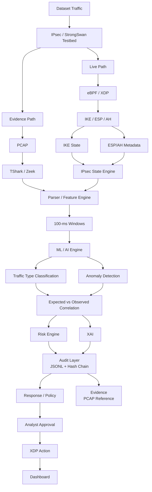

# IPsec Analysis Framework Architecture

## Architecture Flow

1. **Dataset Traffic** enters the IPsec / StrongSwan testbed.
2. Traffic is processed through two paths:
   - **Live Path:** eBPF / XDP captures IKE, ESP, and AH information.
   - **Evidence Path:** PCAP data is analyzed using TShark and Zeek.
3. The live path extracts IKE state and ESP/AH metadata for the **IPsec State Engine**.
4. State and evidence data are combined by the **Parser / Feature Engine**.
5. Features are organized into **100-millisecond windows**.
6. The **ML / AI Engine** performs:
   - Traffic type classification
   - Anomaly detection
7. Results are compared through **Expected vs. Observed Correlation**.
8. The **Risk Engine** and **XAI** components support explainable risk assessment.
9. The **Audit Layer** records JSONL events with a hash chain for integrity.
10. The system generates response policies and evidence references.
11. An analyst approves the response before an **XDP Action** is applied.
12. Results and system status are displayed on the **Dashboard**.
